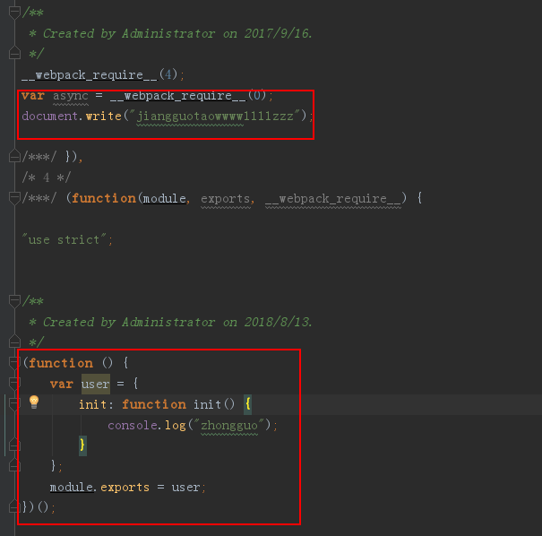
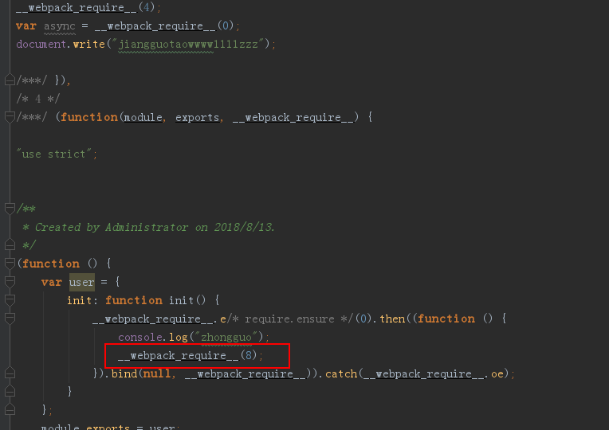
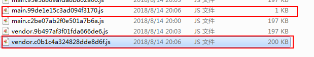
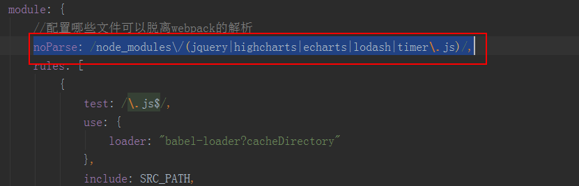

webpack官网文档：https://webpack.github.io/docs/
# webpack的安装
   在安装的过程中，第一次使用npm install webpack，这样在当前目录执行webpack命令，发现报不是内部命令；使用npm install webpack -g就可以了。
# webpack打包命令
webpack app/index.js build/build.js
# webpack配置文件
```
const path = require('path');
module.exports={
    entry:"./app/index.js",
    output:{
        path: path.resolve(__dirname, './bin'),
        filename:"build.js"
    },
    module:{
        loaders:[{
            test:/.css$/,
            loader:["style","css"],
            exclude:"/node_modules/"
        }]
    },
    resolve:{
        extensions:['js','css','jsx']
    }
};
```
配置参数的说明参考：http://www.cnblogs.com/skylar/p/webpack-module-bundler.html  
```
// 默认加载的包声明
        new webpack.ProvidePlugin({
            _: 'lodash',
            $: "jquery"
        }),
```
这样就可以在任何页面都可以使用jquery,而不用require去引入了。  
# npm 删除模块
【npm uninstall xxx】删除xxx模块；
【npm uninstall -g xxx】删除全局模块xxx；
# webpack-server-dev遇到的问题
第一次使用命令webpack-server-dev启动发现总是报错：
```
ERROR in (webpack)/node_modules/querystring-es3/index.js
Module not found: Error: Can't resolve './decode' in 'C:\Users\Administrator\App
Data\Roaming\npm\node_modules\webpack\node_modules\querystring-es3'
 @ (webpack)/node_modules/querystring-es3/index.js 3:33-52
 @ (webpack)/node_modules/url/url.js
 @ (webpack)-dev-server/client?http://localhost:8080
 @ multi (webpack)-dev-server/client?http://localhost:8080 ./app/index.js

ERROR in (webpack)/node_modules/querystring-es3/index.js
Module not found: Error: Can't resolve './encode' in 'C:\Users\Administrator\App
Data\Roaming\npm\node_modules\webpack\node_modules\querystring-es3'
 @ (webpack)/node_modules/querystring-es3/index.js 4:37-56
 @ (webpack)/node_modules/url/url.js
 @ (webpack)-dev-server/client?http://localhost:8080
 @ multi (webpack)-dev-server/client?http://localhost:8080 ./app/index.js
```
找了好久，发现是webpack.config.js里的配置文件写错了，那个自动补充后缀名的属性有问题。
将
```
resolve:{
        extensions:['js','css','jsx']
    }
```
修改为
```
resolve:{
        extensions:[".js",".css","jsx"]
    }
```
这样问题就解决了。
页面刷新实时：webpack-dev-server --progress --color；发现以前使用的命令：webpack-dev-server --hot --inline不可以了，也许是1.0的版本可以。
可以在package.json里配置自定义的npm命令.启动服务就只需要输入npm start
```
"scripts": {
    "test": "echo \"Error: no test specified\" && exit 1",
    "start":"webpack-dev-server --progress --color"
  },
```
# html-webpack-plugin
参考： http://www.cnblogs.com/wonyun/p/6030090.html。具体什么情况下使用，摸不清。结合目前的项目看看吧
# Babel的使用
参考官网：http://babeljs.cn/
webstorm自动将ES6语法js转换为es5的配置：http://www.cnblogs.com/pizitai/p/6830470.html  
# node-glob学习  
https://www.cnblogs.com/liulangmao/p/4552339.html  
const templateFiles = glob.sync(`${urls.page}/*.+(${templateExt.join('|')})`)同步获取文件  
# 代码分割  
## 代码分割 - 使用 require.ensure  
[ webpack 2.2 中文文档](http://www.css88.com/doc/webpack2/guides/code-splitting-require/)
在项目中，加载入口文件的js比较大，原来有些js文件的初始化函数没有使用require.ensure导致编译打包时，打到入口文件里了。  
user.js文件里：  
```js
(function () {
    var user={
        init:function(){
            console.log("zhongguo")
        }
    };
    module.exports=user;
})();
```  
在index.js文件里引入user.js  
```js
require("./js/user.js");
```
这样打的包就会把index.js和user.js打到同一个文件里。如图可以看出：  
  
添加文件account.js  
```js
(function () {
    var account={};
    module.exports=account;
})();
```
在user.js文件里引用account.js文件，修改user.js:  
```js
(function () {
    var user={
        init:function(){
            require.ensure([],function(){
                console.log("zhongguo");
                require("./account.js");
            },"testEnsure");
        }
    };
    module.exports=user;
})();
```
再次打包编译发现多了一个文件：  
  
查看编译后的文件  
  
可以看到使用require.ensure的时候，只有使用了require的引用才会重新生成一个chunk文件，里面是普通的js代码时，还是会和入口文件打到同一个文件里的。  
## 代码分割 -使用CommonsChunkPlugin  
在js文件中我们一般都会使用到第三方的库，很显然我们需要将这些第三方库的js代码给抽取出来作为公共部分，不然我们的入口文件会很大。在项目应用中显然是不合理的。  
[代码分割 - Libraries](http://www.css88.com/doc/webpack2/guides/code-splitting-libraries/)  
在index.js文件里有如下代码,引入了第三方库:
```js
const async=require("async");
document.write("jiangguotaowwww1111zzz");
```
如果我们不使用CommonsChunkPlugin，入口文件编译的bundle就包含了index.js和async.js的代码。如果多引用几个，文件就会很大。如图：  
  
使用CommonsChunkPlugin,在文件里配置：  
```js
//配置入口函数
entry:{
        main:"./app/index.js",
        vendor:'async'
    },
    //使用插件
    plugins:[
            new webpack.optimize.CommonsChunkPlugin({
                name: 'vendor' // 指定公共 bundle 的名字。
            })
        ]
```
这样async就会被打包到vendorbundle里了。从两个文件的大小可以看出来：  
  
话说在项目中应该有很多这样的第三方库吧，我们不可能 vendor:'async'一点一点的这样写吧。那该如何处理呢？  
# 缓存  
[缓存](http://www.css88.com/doc/webpack2/guides/caching/)  
不要在开发环境下使用[chunkhash]，因为这会增加编译时间。将开发和生产模式的配置分开，并在开发模式中使用[name].js的文件名， 在生产模式中使用[name].[chunkhash].js文件名。  
# noParse  
配置那些文件可以脱离webpack的解析，节省构建时间,将会直接引入这个模块.    
  
# externals  
[externals详解](https://www.tangshuang.net/3343.html)   
就是webpack不需要将一些依赖包编译到文件里，让用户自己去提供，程序在文件里引用就行了，*但是不同的环境，externals的配置文件就不一样*。  
在项目中首页index.html已经引入了部分库文件，如图：  
  
由于已经通过script引用了，所以在编译时，不需要将这些依赖包编译打包文件里，直接在文件里引用就行了，webpack配置如图：   
  