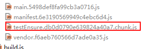

webpack官网文档：https://webpack.github.io/docs/
# webpack的安装
   在安装的过程中，第一次使用npm install webpack，这样在当前目录执行webpack命令，发现报不是内部命令；使用npm install webpack -g就可以了。
# webpack打包命令
webpack app/index.js build/build.js
# webpack配置文件
```
const path = require('path');
module.exports={
    entry:"./app/index.js",
    output:{
        path: path.resolve(__dirname, './bin'),
        filename:"build.js"
    },
    module:{
        loaders:[{
            test:/.css$/,
            loader:["style","css"],
            exclude:"/node_modules/"
        }]
    },
    resolve:{
        extensions:['js','css','jsx']
    }
};
```
配置参数的说明参考：http://www.cnblogs.com/skylar/p/webpack-module-bundler.html  
```
// 默认加载的包声明
        new webpack.ProvidePlugin({
            _: 'lodash',
            $: "jquery"
        }),
```
这样就可以在任何页面都可以使用jquery,而不用require去引入了。  
# npm 删除模块
【npm uninstall xxx】删除xxx模块；
【npm uninstall -g xxx】删除全局模块xxx；
# webpack-server-dev遇到的问题
第一次使用命令webpack-server-dev启动发现总是报错：
```
ERROR in (webpack)/node_modules/querystring-es3/index.js
Module not found: Error: Can't resolve './decode' in 'C:\Users\Administrator\App
Data\Roaming\npm\node_modules\webpack\node_modules\querystring-es3'
 @ (webpack)/node_modules/querystring-es3/index.js 3:33-52
 @ (webpack)/node_modules/url/url.js
 @ (webpack)-dev-server/client?http://localhost:8080
 @ multi (webpack)-dev-server/client?http://localhost:8080 ./app/index.js

ERROR in (webpack)/node_modules/querystring-es3/index.js
Module not found: Error: Can't resolve './encode' in 'C:\Users\Administrator\App
Data\Roaming\npm\node_modules\webpack\node_modules\querystring-es3'
 @ (webpack)/node_modules/querystring-es3/index.js 4:37-56
 @ (webpack)/node_modules/url/url.js
 @ (webpack)-dev-server/client?http://localhost:8080
 @ multi (webpack)-dev-server/client?http://localhost:8080 ./app/index.js
```
找了好久，发现是webpack.config.js里的配置文件写错了，那个自动补充后缀名的属性有问题。
将
```
resolve:{
        extensions:['js','css','jsx']
    }
```
修改为
```
resolve:{
        extensions:[".js",".css","jsx"]
    }
```
这样问题就解决了。
页面刷新实时：webpack-dev-server --progress --color；发现以前使用的命令：webpack-dev-server --hot --inline不可以了，也许是1.0的版本可以。
可以在package.json里配置自定义的npm命令.启动服务就只需要输入npm start
```
"scripts": {
    "test": "echo \"Error: no test specified\" && exit 1",
    "start":"webpack-dev-server --progress --color"
  },
```
# html-webpack-plugin
参考： http://www.cnblogs.com/wonyun/p/6030090.html。具体什么情况下使用，摸不清。结合目前的项目看看吧
# Babel的使用
参考官网：http://babeljs.cn/
webstorm自动将ES6语法js转换为es5的配置：http://www.cnblogs.com/pizitai/p/6830470.html  
# node-glob学习  
https://www.cnblogs.com/liulangmao/p/4552339.html  
const templateFiles = glob.sync(`${urls.page}/*.+(${templateExt.join('|')})`)同步获取文件  
# 代码分割  
## 代码分割 - 使用 require.ensure  
[ webpack 2.2 中文文档](http://www.css88.com/doc/webpack2/guides/code-splitting-require/)
在项目中，加载入口文件的js比较大，原来有些js文件的初始化函数没有使用require.ensure导致编译打包时，打到入口文件里了。  
user.js文件里：  
```js
(function () {
    var user={
        init:function(){
            console.log("zhongguo")
        }
    };
    module.exports=user;
})();
```  
在index.js文件里引入user.js  
```js
require("./js/user.js");
```
这样打的包就会把index.js和user.js打到同一个文件里。如图可以看出：  
  
添加文件account.js  
```js
(function () {
    var account={};
    module.exports=account;
})();
```
在user.js文件里引用account.js文件，修改user.js:  
```js
(function () {
    var user={
        init:function(){
            require.ensure([],function(){
                console.log("zhongguo");
                require("./account.js");
            },"testEnsure");
        }
    };
    module.exports=user;
})();
```
再次打包编译发现多了一个文件：  
  
查看编译后的文件  
  
可以看到使用require.ensure的时候，只有使用了require的引用才会重新生成一个chunk文件，里面是普通的js代码时，还是会和入口文件打到同一个文件里的。  
## 代码分割 -使用CommonsChunkPlugin  
在js文件中我们一般都会使用到第三方的库，很显然我们需要将这些第三方库的js代码给抽取出来作为公共部分，不然我们的入口文件会很大。在项目应用中显然是不合理的。  
[代码分割 - Libraries](http://www.css88.com/doc/webpack2/guides/code-splitting-libraries/)  
在index.js文件里有如下代码,引入了第三方库:
```js
const async=require("async");
document.write("jiangguotaowwww1111zzz");
```
如果我们不使用CommonsChunkPlugin，入口文件编译的bundle就包含了index.js和async.js的代码。如果多引用几个，文件就会很大。如图：  
  
使用CommonsChunkPlugin,在文件里配置：  
```js
//配置入口函数
entry:{
        main:"./app/index.js",
        vendor:'async'
    },
    //使用插件
    plugins:[
            new webpack.optimize.CommonsChunkPlugin({
                name: 'vendor' // 指定公共 bundle 的名字。
            })
        ]
```
这样async就会被打包到vendorbundle里了。从两个文件的大小可以看出来：  
  
话说在项目中应该有很多这样的第三方库吧，我们不可能 vendor:'async'一点一点的这样写吧。那该如何处理呢？  
# 缓存  
[缓存](http://www.css88.com/doc/webpack2/guides/caching/)  
不要在开发环境下使用[chunkhash]，因为这会增加编译时间。将开发和生产模式的配置分开，并在开发模式中使用[name].js的文件名， 在生产模式中使用[name].[chunkhash].js文件名。  
# noParse  
配置那些文件可以脱离webpack的解析，节省构建时间,将会直接引入这个模块.    
  
# externals  
[externals详解](https://www.tangshuang.net/3343.html)   
就是webpack不需要将一些依赖包编译到文件里，让用户自己去提供，程序在文件里引用就行了，*但是不同的环境，externals的配置文件就不一样*。  
在项目中首页index.html已经引入了部分库文件，如图：  
  
由于已经通过script引用了，所以在编译时，不需要将这些依赖包编译打包文件里，直接在文件里引用就行了，webpack配置如图：   
   
 # publicPath  
 [官网解释](http://www.css88.com/doc/webpack2/guides/public-path/)  
 webpack 提供一个非常有用的配置，该配置能帮助你为项目中的所有资源指定一个基础路径。它被称为公共路径(publicPath)。  
 在项目中之前我们没有配置这个，启动webpack的时候，进行菜单切换就会有问题，那是因为我们菜单的配置都是写了项目的（如:/ims_smart_web/^^）。当没有配置时本地直接在/下，所以路径都
 不对，这是加上publicPath这个配置，并且值为/ims_smart_web/就可以了。配置代码如下：     
 ```js
 devServer: {
         port: 3000,
         publicPath: PUBLIC_PATH,
         overlay: {
             errors: true,
             warnings: true
         }
     }
 ```
 ```js
 output: {
         path: path.join(ROOT_PATH, 'dist'),
         publicPath: PUBLIC_PATH,
         filename: "js/[name].[chunkhash].js",
         chunkFilename: "js/[name].[chunkhash].chunk.js"
     }
 ```
 对于按需加载(on-demand-load)或加载外部资源(external resources)（如图片、文件等）来说，output.publicPath 是很重要的选项。如果指定了一个错误的值，则在加载这些资源时会收到 404 错误。 
 此选项指定在浏览器中所引用的「此输出目录对应的公开 URL」。相对 URL(relative URL) 会被相对于 HTML 页面（或 <base> 标签）解析。相对于服务的 URL(Server-relative URL)，相对于协议的 URL(protocol-relative URL) 或绝对 URL(absolute URL) 也可是可能用到的，或者有时必须用到，例如：当将资源托管到 CDN 时。  
 该选项的值是以 runtime(运行时) 或 loader(加载器载入时) 所创建的每个 URL 为前缀。因此，在多数情况下，此选项的值都会以/结束。  
 默认值是一个空字符串 ""。  
 这样我就理解了，当初在项目中本地启动webpack图片显示不出来，而发环境后图片能正确显示的原因了(在加载 CSS 的一个图片时,webpack-dev-server 也会默认从 publicPath 为基准，
 使用它来决定在哪个目录下启用服务，来访问 webpack 输出的文件。)。所以建议在开发的时候还是配置publicPath这个属性.  
 重点参考[output的各项配置](http://www.css88.com/doc/webpack2/configuration/output/)  
 # Module  
 [Module各项配置说明](http://www.css88.com/doc/webpack2/configuration/module/)  
   ## rules  
   官网给的说明，但是自己不怎理解。  
   >创建模块时，匹配请求的规则数组。这些规则能够修改模块的创建方式。这些规则能够对模块(module)应用加载器(loader)，或者修改解析器(parser)。
   
   ### use  
   应用于模块的 UseEntries 列表。每个入口(entry)指定使用一个 loader。  
   ### test   
   匹配条件。约定了提供一个正则或正则数组，但不是强制的。  
   ### include  
   匹配条件。约定了提供一个字符串或字符串数组，但不是强制的。  
   ### exclude  
   不能匹配条件。约定了提供一个字符串或字符串数组，但不是强制的。  
# devServer  
[devServer配置](http://www.css88.com/doc/webpack2/configuration/dev-server/)  
本地开发环境使用的配置项。通过来自 webpack-dev-server 的这些选项，能够用多种方式改变其行为。  
# dectool  
[开发工具](http://www.css88.com/doc/webpack2/configuration/devtool/)  
eval - 每个模块都使用 eval() 执行，并且都有 //@ sourceURL。此选项会相当快地构建。主要缺点是，由于会映射到转换后的代码，而不是映射到原始代码，所以不能正确的显示显示行数。  
inline-source-map - SourceMap 转换为 DataUrl 后添加到 bundle 中。  
eval-source-map - 每个模块使用 eval() 执行，并且 SourceMap 转换为 DataUrl 后添加到 eval() 中。初始化 SourceMap 时比较慢，但是会在重构建时提供很快的速度，并且生成实际的文件。行数能够正确映射，因为会映射到原始代码中。  
cheap-module-eval-source-map - 就像 eval-source-map，每个模块使用 eval() 执行，并且 SourceMap 转换为 DataUrl 后添加到 eval() 中。"低开销"是因为它没有生成列映射(column map)，只是映射行数。  

# 插件  
## ProvidePlugin  
[ProvidePlugin](http://www.css88.com/doc/webpack2/plugins/provide-plugin/)  
使用该插件加载的bundle库类，可以在整个应用中直接使用。官网解释是
>自动加载模块。 任何时候，当 identifier 被当作未赋值的变量时， module 就会自动被加载，并且 identifier 会被这个 module 输出的内容所赋值。实例代码如下：    
```js
new webpack.ProvidePlugin({
  $: 'jquery',
  jQuery: 'jquery'
})
```
在实际项目中使用示例：  
```js
new webpack.ProvidePlugin({ //加载jq
            _: 'lodash',
            $: "jquery"
        })
```
## extract-text-webpack-plugin  
提取单独打包css文件  
## transfer-webpack-plugin  
将源目录文件copy到目标目录文件  
## htmlWebpackPlugin  
```js
new htmlWebpackPlugin({
            title:"欢迎",
            // chunks:["build"]
            filename:"index.html",
            template:'./index.html',
            chunks:["main"],    //需要引入的chunk
            inject:true,
            hash:true
        })
```
- filename:生成html存放路径，相对于编译包的目录.  
- template:html模板路径。  
- chunks:页面需要引入的js文件  
- inject:允许插件修改head与body  
- hash:为静态资源生成hash值  
# optimization  
<a name="optimization"></a>  
[optimization解释](https://blog.csdn.net/qq_16339527/article/details/80641245)  
这个是webpack4新特性，optimization.splitChunks来进行代码的拆分，使用optimization.runtimeChunk来提取webpack的runtime代码，引入了新的cacheGroups概念。
之前CommonsChunkPlugin虽然能用，但是配置不够灵活，难以理解，minChunks有时候为数字，有时候为函数，并且如果同步模块与异步模块都引入了相同的module并不能将公共部分提取出来，
最后打包生成的js还是存在相同的module。  
- minSize：30000//模块大于30k会被抽离到公共模块
- minimize:true//是否进行代码压缩  
- minChunks:1//模块出现1次就会被抽离到公共模块  
- maxAsyncRequests:5// 异步模块，一次最多只能被加载5个  
- maxInitialRequests:3// 入口模块最多只能加载3个  
```js
optimization: {
        splitChunks: {
            chunks: 'initial',
            minSize: 0,
            name: true,
            cacheGroups: {
                default: {
                    name: 'app',
                    chunks: 'initial',
                    enforce: true,
                    reuseExistingChunk: true,
                    minChunks: 2,
                },
                vendors: {
                    name: 'vendors',
                    enforce: true,
                    test: /[\\/]node_modules[\\/]/,
                    priority: 10,
                    reuseExistingChunk: true,
                    minChunks: 1,
                },
                commons: {
                    name: 'commons',
                    enforce: true,
                    chunks: 'initial',
                    minChunks: 1,
                    test: /[\\/]components[\\/]/,
                    priority: 10,
                    reuseExistingChunk: true,
                },
                screens: {
                    name: 'screens',
                    enforce: true,
                    chunks: 'initial',
                    minChunks: 1,
                    test: /[\\/]screens[\\/]/,
                    priority: 5,
                    reuseExistingChunk: true,
                },
                tpl: {
                    name: 'tpl',
                    enforce: true,
                    chunks: 'initial',
                    minChunks: 1,
                    test: /[\\/]tpl[\\/]/,
                    priority: 5,
                    reuseExistingChunk: true,
                },
            },
        },

    }
```
有了这些配置，我们几乎不需要任何成功就能删除之前CommonChunkPlugin的代码。  
通过判断splitChunks.chunks的值来确定哪些模块会提取公共模块，该配置一共有三个选项，initial、async、 all。 
默认为async，表示只会提取异步加载模块的公共代码，initial表示只会提取初始入口模块的公共代码，all表示同时提取前两者的代码。
这三种方式的区别请参考标题下的optimization解释(#optimization)   